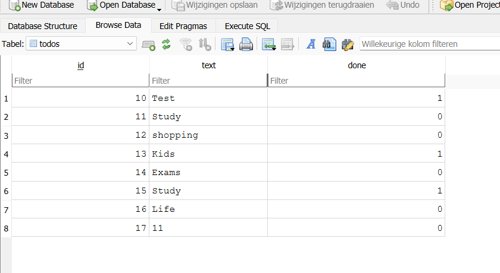
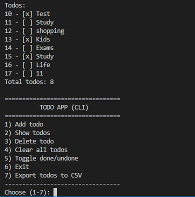

## Todo App

Small CLI todo application :

\- git workflow

\- .gitignore

\- virtual environment (.venv)

\- packages/modules (ui, service, data, domain)

\- requirements.txt

## Setup

1. Create a virtual environment
2. Install dependencies:
   pip install -r requirements.txt
3. Run the application:
   python main.py

python -m venv .venv

.\\\\.venv\\\\Scripts\\\\Activate.ps1

pip install -r requirements.txt

## Features
- Add a todo
- Show all todos
- Delete a todo
- Clear all todos (with confirmation)
- Export todos to CSV

## Database
- SQLite database stored in `db/todo_app.db`
- Sample database available at `db/sample_todo.db`
### Database (DB Browser for SQLite)

## Project structure
- `main.py` – entry point of the application
- `data.py`  – database access and exporters
- `ui/` – user interface (CLI, input/output)
- `service/` – business logic
- `data/` – data access (file storage)
- `domain/` – domain objects

## Architecture
The project is structured in layers:
- UI layer depends on the Service layer
- Service layer depends on the Domain and Data layers
- Data layer only handles storage

## How the application works

The application is a simple command-line todo app.

- The user interacts with the app via a text-based menu.
- The UI layer (`ui`) handles user input and output.
- The service layer (`service`) contains the application logic.
- The data layer (`data`) reads and writes todos to database.
- Todos are stored in a SQL database.

Each todo can be:
- added
- listed
- deleted
- marked as done or undone
### Command Line Interface

The application starts from `main.py`.

## Tools
- Python 3
- SQLite

